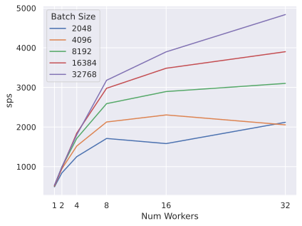
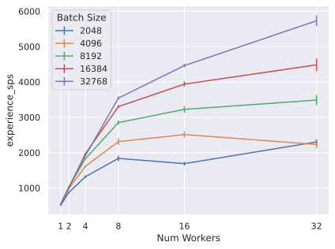
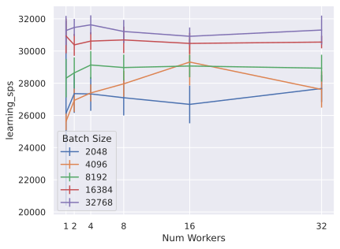
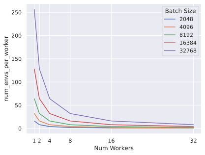
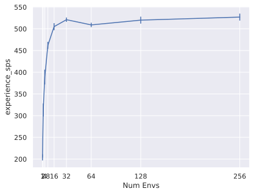
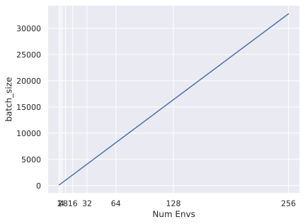
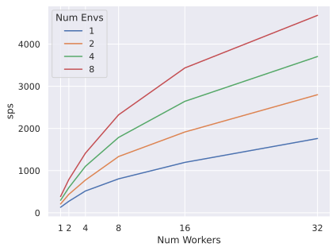
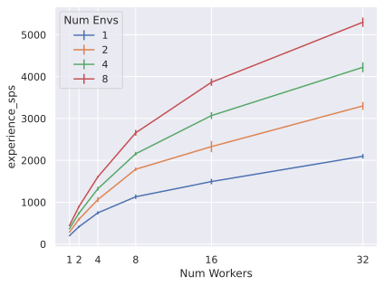
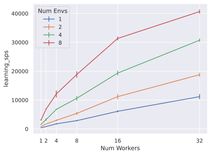

# Single Machine Distributed Recurrent PPO  


## Overview

Proximal Policy Optimization (PPO) is arguably the most popular deep RL methods out there. It can be used for both discrete and continuous actions, while being relatively robust to hyperparameter choices. It's also relatively simple to parallelize PPO using multiple workers that collect each batch of data in parallel, before sending the data to a central learner.

This implementation of PPO is designed to work with recurrent neural networks and to be run on a single machine with multiple CPU cores which communicate via shared memory. Restricting the implementation to a single machine means we can use a relatively simple distributed design, while producing significant speed-ups when running on a single machine with multiple cores.

Original Paper:

- [Schulman et al (2017) Proximal Policy Optimization Algorithms](https://arxiv.org/abs/1707.06347)

Further reading and resources:

- [OpenAI Spinning Up](https://spinningup.openai.com/en/latest/algorithms/ppo.html)
- [CleanRL PPO](https://docs.cleanrl.dev/rl-algorithms/ppo/)


## Usage

The core PPO algorithm is implemented in [ppo.py](https://github.com/Jjschwartz/miniDRL/blob/main/minidrl/ppo/ppo.py). It cannot be run directly, but contains a single file implementation of PPO except environment specific code (e.g. environment and network creation functions). It is used by the following scripts, which contain the environment specific code:

### ``ppo/run_gym.py``

This script can be used to train a PPO agent on any [Gymnasium](https://gymnasium.farama.org/) environment. For example, run:

```bash
# to get all options
python minidrl/ppo/run_gym.py --help
# to train an agent on the `CartPole-v1` environment
python minidrl/ppo/run_gym.py --env_id CartPole-v1
```

### ``ppo/run_minigrid.py``

This script can be used to train a PPO agent on [Minigrid](https://minigrid.farama.org/) environments. For example, run:

```bash
# to get all options
python minidrl/ppo/run_minigrid.py --help
# to train an agent on the `MiniGrid-Empty-5x5-v0` environment
python minidrl/ppo/run_minigrid.py --env_id MiniGrid-Empty-5x5-v0
```

### ``ppo/run_atari.py``

This script can be used to train a PPO agent on [Atari](https://gymnasium.farama.org/environments/atari/) environments. For example, run:

```bash
# to get all options
python minidrl/ppo/run_atari.py --help
# to train an agent on the `PongNoFrameskip-v4` environment
python minidrl/ppo/run_atari.py --env_id PongNoFrameskip-v4
```

## Explanation of logged metrics

Running the miniDRL PPO implementaion will automatically record various metrics such as losses and mean episode returns in [Tensorboard](https://www.tensorflow.org/tensorboard) (and optionally [WandB](https://wandb.ai/)). Below is some information for these metrics:

- `charts/global_step`: the current training step
- `charts/update`: the number of policy updates performed
- `charts/episodic_return_[mean, min, max]`: the `[mean, min, max]` episodic return of the game
- `charts/episodic_length_[mean, min, max]`: the `[mean, min, max]` episodic length of the game
- `charts/SPS`: number of steps per second
- `charts/collection_time`: the time taken for collecting batch of trajectories
- `charts/learning_time`: the time taken for updating policy on a batch of trajectories
- `charts/learning_rate`: the current learning rate
- `losses/loss`: the mean total loss across batch
- `losses/value_loss`: the mean value loss across batch
- `losses/policy_loss`: the mean policy loss across batch
- `losses/entropy`: the mean entropy value across batch
- `losses/old_approx_kl`: the approximate Kullback–Leibler divergence, measured by (-logratio).mean(), which corresponds to the k1 estimator in John Schulman’s blog post on approximating KL
- `losses/approx_kl`: better alternative to olad_approx_kl measured by (logratio.exp() - 1) - logratio, which corresponds to the k3 estimator in approximating KL
- `losses/unclipped_grad_norm`: the norm of gradients before any gradient clipping
- `losses/clipfrac`: the fraction of the training data that triggered the clipped objective
- `losses/explained_variance`: the explained variance for the value function

It is also possible to capture videos of the agent playing the game. To do this, set `capture_video=True` in the `ppo/run_[gym, minigrid, atari].py` scripts. This will record a video of the agent playing the game at given intervals during training. The videos will be saved locally to the log directory. If using wandb, they will also be uploaded to wandb and can be viewed in the wandb dashboard.

## Distributed Architecture

This implementation of PPO uses a single learner and multiple workers. Each worker runs a copy of the environment and collects a batch of data using the latest version of the policy parameters. The data is then sent to the learner, which performs a gradient update and sends the updated policy parameters back to the workers. The workers then update their local copy of the policy and collect another batch of data.

The following diagram shows a high-level of the distributed architecture:


There are a number of important features to note:

### 1. Policy updates and experience collection are synchronized

The learner will wait for all workers to finish collecting a batch before performing a gradient update, and the workers will wait to recieve the latest policy parameters before collecting another batch of data. 

This greatly simplifies the implementation since we don't need to worry about off-policy corrections or stale data. However, it also means that the learner is idle while the workers are collecting data, and the workers are idle while the learner is performing a gradient update. This is not ideal, but it's a reasonable tradeoff for simplicity. Other architectures such as [IMPALA](http://proceedings.mlr.press/v80/espeholt18a/espeholt18a.pdf) overcome this limitation.

### 2. Rollouts and policy parameters are shared via shared memory

Our implementation of PPO uses the [torch.multiprocessing](https://pytorch.org/docs/stable/multiprocessing.html) library which handles efficiently sharing data between processes using shared memory. This is greatly reduces the communication overhead between the learner and workers since we don't need to serialize and deserialize the data.

### 3. Supports single machine only

This implementation of PPO is relatively simple, and leads to massive speed-ups when running on a single machine with multiple cores. However, it does not support running across multiple machines since it relies on the shared memory of a single machine. This is a reasonable tradeoff for simplicity, but it does mean that we can't scale to hundreds of workers across multiple machines.


## Implementation details

1. [torch.multiprocessing.queues](https://pytorch.org/docs/stable/multiprocessing.html) are used for communication between processes. This handles moving data into shared memory and efficiently sharing the location of this data between processes.
2. In our implementation each rollout worker uses only a single CPU core. This is fine for the environments and models we're using. For larger models you could also assign GPUs to each worker, but would have to be careful about running out of GPU memory.


## Experimental Results

### Scaling of Steps Per Second (SPS) 

Here we look at how the steps per second (SPS) scales with number of CPUs used. Here each step corresponds to an action executed in the environment. We also look at the experience steps per second (experience SPS) which is the number of steps collected by the workers per second. Finally, we look at the learning SPS which is the number of steps per second that the learner is performing gradient updates.

For all results we use the Atari `PongNoFrameskip-v4` environment running on a single machine with 48 CPU cores and using a single NVIDIA 2080Ti GPU. For all experiments we use the GPU for the learner only, while the workers run on the CPU.

#### SPS Scaling with Fixed Batch Size

First we look at how SPS scales with the number of rollout workers for different fixed batch sizes: 



Each line shows SPS for a different batch size as the number of workers increases. As you can see for most batch sizes SPS increases with the number of workers and SPS tends scales almost linearly with number of workers, up to around 8 workers before growth starts to slow down. This shows that our implementation is able to scale somewhat efficiently with the number of workers, which is good news. But it'll be good to know what causes the slowdown for higher number of workers.

Diving deeper we can look at the various factors controlling overall SPS, namely the data collection step (**experience SPS**) and the learning step (**learning SPS**). 





As you can see the experience SPS scales with number of workers, showing a similar pattern to the global SPS. On the otherhand learning SPS is relatively constant for a given batch size. This is because in these experiments the learner does the same amount of work (i.e. has same batch size) irrespective of the number of workers. So the benefit in terms of scaling comes from parallelization of the data collection.

Another key takeaway is that increasing the batch size generally leads to better SPS. This makes sense since increasing batch size will lead to more efficient utilization of the GPU and in some cases CPU (via SIMD) utilization. However, there is a limit to how much we can increase the batch size before we run out of memory, and larger batch sizes may also lead to slower learning. So there is a trade-off between batch size, SPS, and learning efficiency.

#### SPS Scaling with Number of Environments per Worker for a Single Worker

If we take a closer look at SPS and experience SPS versus number of workers when using a fixed batch size, we observe that the growth in SPS slows down as we increase the number of workers beyond a certain point. This can mostly be attributed to the number of environments per worker decreasing as we increase the number of workers:



One of the simplest and most effective ways to increase SPS in deep RL algorithms is to use vectorized environments. This allows for querying the policy for batches of actions, rather than a single action at a time which offers a significant boost in terms of SPS. We can see this in action by looking at how SPS scales for a single worker as the number of environments per worker is increased:



As you can see, SPS scales with the number of environments per worker up to a certain limit (around 16-32). Increasing the number of environment will of course increase the batch size for the learner, so given a fixed batch size there will be a trade-off between the number of environments per worker and the number of workers, in terms of getting the best SPS.



#### SPS Scaling with Fixed Number of Environment per Worker

Finally, we can look at how SPS scales with the number of workers when we fix the number of environments per worker. In this case the batch size will grow with the number of workers, but it will give us a better idea of how SPS scales as workers are added since adding additional workers will not change the number of environments of the other workers. 



Similar to when we used a fixed batch size, we can see that SPS scales with the number of workers, except this time scaling is closer to linear. Although, this is also affected by the increased batch size. So we can also look at the experience SPS and learning SPS separately:



Experience SPS scales almost linearly with the number of workers, which means our implementation is scaling well.



We also see that learning SPS also scales almost linearly with the number of workers. This is because the batch size is increasing with the number of workers which leads to more efficient utilization of the GPU per minibatch and thus higher throughput (assuming the GPU has enough memory to handle the larger batch size).


### Scaling of Learning Speed

Increasing the SPS is great, but we also want to know how the learning speed scales with the number of workers. Here we look at the learning curves of our PPO implementation on the Atari `PongNoFrameskip-v4` environment with a fixed batch size of `16384` and minibatch size of `2048`, with the number of environments per worker adjusted based on the number of workers.

First we look at the learning curves against training step for runs with different number of workers:


The learning curves are very similar for the different number of workers. So given the same number of interactions, there does not appear to be any significant difference between final performance as we increase the number of workers. There is of course some variability in the final performance due to the random seed, etc.. but this is to be expected for RL. Running multiple seeds would help to reduce this, but this is good enough for our purposes. 

Next lets look at the learning curves against wall time:


Here we can see a clear benefit in terms of wall time as we increase the number of workers. The more workers the quicker the training time, which is exactly what we want to see. There does appear to be some diminishing returns as we increase the number of workers, but this is to be expected as the number of environments per worker decreases as we increase the number of workers.

### Performance on Atari

Finally, we can compare the performance of our implementation of PPO against results from [RaindbowDQN](https://arxiv.org/pdf/1710.02298.pdf), PPO Atari results from a recent paper (See [DNA paper](https://proceedings.neurips.cc/paper_files/paper/2022/hash/e95475f5fb8edb9075bf9e25670d4013-Abstract-Conference.html)), and [R2D2](https://openreview.net/forum?id=r1lyTjAqYX&utm_campaign=RL). We compare performance on the [Atari-5 Benchmark](https://proceedings.mlr.press/v202/aitchison23a.html) (plus Pong), training for 200M steps using 32 workers, which took around 15 hours for each environment .

These results should be taken with a large grain of salt, since the various papers may have used different hyperparameters, etc. However, it does give us a rough idea of how our implementation of PPO compares to other methods. Note, results for R2D2 use significantly more training steps (10B compared with 200M for ours and other results).

| Game         | Human   | PPO (this repo) | PPO (DNA Paper) | Rainbow DQN | R2D2    |
| ------------ | ------- | --------------- | --------------- | ----------- | --------|
| BattleZone   | 37188   | 226,333         | 82,834          | 62,010      | 751,880 |
| DoubleDunk   | -16.4   | -0.4            | -1.3            | -0.3        | 23.7    |
| NameThisGame | 8049    | 24,280          | 20,053          | 13,136      | 58,183  |
| Phoenix      | 7242.6  | 483,164         | 220,560         | 108,529     | 864,020 |
| Pong         | 14.6    | 21.0            | 19.6            | 20.9        | 21.0    |
| Qbert        | 13455   | 41,708          | 8,836           | 33,817      | 408,850 |

Interestingly, our implementation of PPO performs significantly better than the PPO from the DNA paper (which has some of the best PPO atari results AFAIK) as well as Rainbow DQN. Given our implementation uses many of the hyperparameters used in the DNA paper's PPO implementation the most likely reason for this difference is the use of an LSTM based network for our implementation. This is also supported by the fact that R2D2, which also uses an LSTM based network, performs significantly better than non-recurrent network based agents. 

Below are the learning curves for our implementation of PPO on the Atari-5 benchmark. The bold line shows the running average over the last 10M steps.

**BattleZone**


**DoubleDunk**


**NameThisGame**


**Phoenix**


**Pong**


**Qbert**


### All Training Results

For those interested, you can access all the training results on the miniDRL wandb project page: https://wandb.ai/jjschwartz/miniDRL/