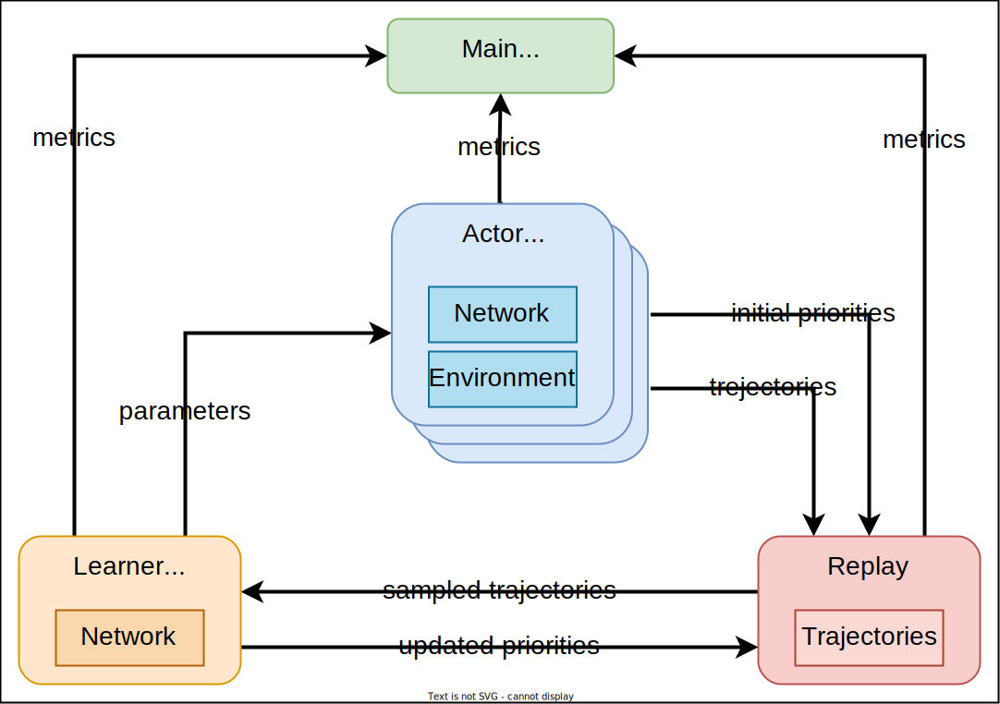

# Single Machine R2D2

## Overview

Recurrent Replay Distributed DQN (R2D2) is a variant of the classic off-policy, value-based DQN algorithm with two key features:

1. a recurrent neural network (RNN) for the Q-function
2. a distributed prioritized experience replay buffer. 

The RNN is trained on sequences of observations, rather than just the usual most recent observation for most popular DQN agents. The distributed replay buffer is designed to support multiple actors collecting experience in parallel, which can then used by a central learner for updating the Q-function. This combination of RNN based policy plus distributed training allowed R2D2 to achieve SOTA results in Atari and DM-Lab in less wall clock time than non-distributed baselines (DQN, Rainbow).

This implementation of R2D2 is designed to be used with a single machine with multiple CPU cores and a single GPU (although GPU is not required, but recommended). Restricting the implementation to a single machine means we can use a relatively simple distributed design and take advantage of using shared memory for communication between processes. It does however limit the scalability of the implementation to the number of cores available on a single machine.

Original Paper:

- [Recurrent Experience Replay in Distributed Reinforcement Learning](https://openreview.net/pdf?id=r1lyTjAqYX)

Further reading and resources:

- [Ape-X paper: Distributed Prioritized Experience Replay](https://arxiv.org/abs/1803.00933) which introduced the distributed replay buffer extended by R2D2
- [Priotizied Experience Replay Paper](https://arxiv.org/pdf/1511.05952.pdf)
- [Deep RL Zoo](https://github.com/michaelnny/deep_rl_zoo) which has a PyTorch implementation of R2D2

## Usage

The core R2D2 algorithm is implemented in [r2d2.py](https://github.com/Jjschwartz/miniDRL/blob/main/minidrl/r2d2/r2d2.py) and [replay.py](https://github.com/Jjschwartz/miniDRL/blob/main/minidrl/r2d2/replay.py). It cannot be run directly, however the full implementation of R2D2 is contained within the two files. The only thing not included is environment specific code such as functions for leading the environment and environment specific network. The following scripts implement the environment specific code for running R2D2:

### ``r2d2/run_gym.py``

This script can be used to train a R2D2 agent on any [Gymnasium](https://gymnasium.farama.org/) environment that has discrete actions. For example, run:

```bash
# to get all options
python minidrl/r2d2/run_gym.py --help
# to train an agent on the `CartPole-v1` environment
python minidrl/r2d2/run_gym.py --env_id CartPole-v1
```

### ``r2d2/run_atari.py``

This script can be used to train a R2D2 agent on [Atari](https://gymnasium.farama.org/environments/atari/) environments. For example, run:

```bash
# to get all options
python minidrl/r2d2/run_atari.py --help
# to train an agent on the `PongNoFrameskip-v4` environment
python minidrl/r2d2/run_atari.py --env_id PongNoFrameskip-v4
```

It's default hyperparameters are the same as those used in the original R2D2 paper.

> **_NOTE:__** Running R2D2 in Atari with the default hyperparamters (the ones used in the paper) requires a lot of RAM for the replay buffer. If you run out of memory, try reducing the replay buffer size by setting `--replay_buffer_size` to a smaller value (e.g. `--replay_buffer_size 10000`) or reduce the sequence lengths (e.g. `--seq_len 10`, `--burin_len 0`). Depending on the environment this may reduce performance.

## Explanation of logged metrics

Running the miniDRL R2D2 implementaion will automatically record various metrics such as losses and mean episode returns in [Tensorboard](https://www.tensorflow.org/tensorboard) (and optionally [WandB](https://wandb.ai/)). Below is some information for these metrics:

- `charts/global_step`: the current training step. This is the total number of individual environment steps (i.e. frames) used to train the model.
- `charts/update`: the number of policy network updates performed
- `charts/learner_SPS`: number of environment steps per second processed for updating the network 
- `charts/learner_UPS`: number of policy network updates per second
- `charts/sample_time`: the time required to sample a batch of `num_prefetch_batches` batches of data from the replay buffer
- `charts/sample_time_per_batch`: the amortized time required to sample a single batch of data from the replay buffer (i.e. `sample_time / num_prefetch_batches`)
- `charts/burnin_time`: the time required for performing the sequence burnin (i.e. getting initial lstm state) each update
- `charts/learning_time`: the time required for computing the loss and backpropogation each update
- `charts/update_time_per_batch`: the total time required each update
- `losses/learning_rate`: the current learning rate
- `losses/value_loss`: the mean value loss across batch
- `losses/q_max`: the max Q-value for any sequence in the batch (note if `value_rescaling` is used (the default) then this is the scaled value so may be lower than you expect)
- `losses/[mean,min,max]_priorities`: the mean/min/max replay priority assigned to the sequences in the batch
- `losses/unclipped_grad_norm`: the norm of gradients before any gradient clipping
- `actor/actor_steps`: the total number of environment steps processed on an individual actor
- `actor/actor_sps`: the number of environment steps per second processed on an individual actor
- `actor/estimated_total_actor_sps`: the estimated total number of environment steps per second processed across all actors (this is an estimate based on the number of actors and the mean actor SPS)
- `actor/[mean,min,max]_episode_return`: the mean/min/max episode return generated on the actor
- `actor/mean_episode_lengths`: the mean episode length generated on the actor
- `actor/actor_episodes_completed`: the total number of episodes completed by an individual actor
- `replay/size`: the number of sequences currently in the replay buffer
- `replay/seqs_added`: the total number of sequences that have been added to the replay buffer (total individual environment steps is `seqs_added * seq_len`)
- `replay/seqs_sampled`: the total number of sequences that have been sampled from the replay buffer by the learner
- `replay/replay_ratio`: the "replay ratio", which is the effective number of time each experienced sequence has been used by the learner for training the policy network. This is computed as `seqs_sampled / seqs_added`.
- `replay/added_seq_per_sec`: the number of sequences added to the replay buffer per second by the actors 
- `replay/added_batch_per_sec`: the number of batches added to the replay buffer per second by the actors (each actor batch is `num_envs_per_actor` sequences)
- `replay/sampled_seq_per_sec`: the number of sequences sampled from the replay buffer per second by the learner 
- `replay/sampled_batch_per_sec`: the number of batches sampled from the replay buffer per second by the learner (each learner batch is `batch_size` * `num_prefetch_batches` sequences)
- `replay/q_size`: the number of sequences currently in the replay buffer queue waiting to be added to the replay (default max is `2 * num_actors`)


> **_NOTE:__** The `actor` logged metrics are produced by a single actor. Specifically the actor whose `epsilon` exploration value is closes to `0.05`.


It is also possible to capture videos of the agent playing the game. To do this, set `capture_video=True` in the `r2d2/run_[gym,, atari].py` scripts. This will record a video of the agent playing the game at given intervals during training. The videos will be saved locally to the log directory. If using wandb, they will also be uploaded to wandb and can be viewed in the wandb dashboard.

## Distributed Architecture

This implementation of R2D2 uses a seperate process for the learner, the replay buffer, and each of the actors. Each actor runs a copy of the environment and continuosly collects trajectory sequences and sends them to the replay, while periodically getting the latest policy parameters from the learner. Meanwhile the replay constantly adds new sequences to the replay buffer as they are sent by the actors, while the learner constantly samples sequences from the replay buffer and updates the policy parameters. 

Each process runs on a single CPU, with the learner also using a GPU if available. This is fine for the environments and models we're using. For larger models you could also assign GPUs to each actor via the `actor_device` parameter, but would have to be careful about running out of GPU memory.

There is also a main process in addition to the learner, replay, and actor processes, which handles spawning the other processes and logging metrics to Tensorboard (and optionally WandB). It also manages terminating the other processes when training is complete or an error occurs.

The following diagram shows the overall architecture:



There are a number of key features to note:

### 1. Batched sequence collection on Actors

Each actor runs a vectorized environment and so collects batches of trajectory sequences with `num_envs_per_actor` sequences collected in parallel using a vectorized environment. This means that each time the actor sends a batch of sequences to the replay buffer, it is actually sending `num_envs_per_actor` sequences. This is more efficient than sending each sequence individually (as they discuss in the original paper).

### 2. Sharing model parameters between learner and the Actors

Each actor updates their local network copy with the latest learner network parameters asynchronously every `actor_update_interval` steps. To make this effecient, the learner maintains a copy of the latest network parameters in shared memory which it updates after each update (or batch of updates). Before training starts the learner send each actor a reference to the shared network parameters so they can quickly access the latest version of the weights as needed .

### 3. Shared Memory

Our implementation of R2D2 uses the [torch.multiprocessing](https://pytorch.org/docs/stable/multiprocessing.html) library which handles efficiently sharing data between processes using shared memory. This is greatly reduces the communication overhead between the learner, replay, and actor processes since there is less time spent serializing and deserializing data.

[torch.multiprocessing.queues](https://pytorch.org/docs/stable/multiprocessing.html) are used for communication between processes. This handles moving data into shared memory and efficiently sharing the location of this data between processes.

### 4. Prefetching Batches from the Replay Buffer

Like in the original paper, the learner implements two important strategies to improve throughput:

1. *prefetching batches from the replay buffer*: the learner requests the next batch of data from the replay for the next update prior to the learner performing the current update. This means the training batch is ready for the learner at the start of each update, minimizing any GPU downtime
2. *sampling multiple batches from replay*: instead of sampling a single batch at a time from the replay buffer, the learner will sample `num_prefetch_batch` batches at a time. This means the learner can perform multiple updates between sampling from the replay, amortizing the communication overhead that comes from sampling from the replay.
